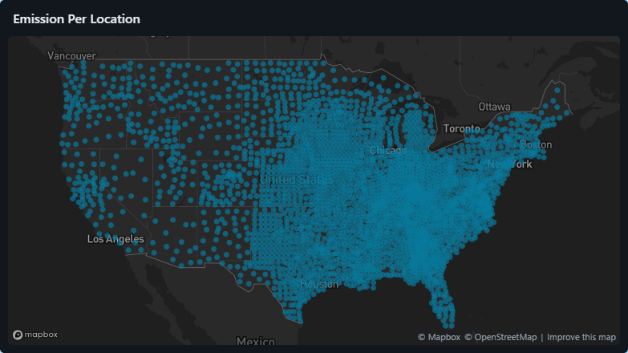
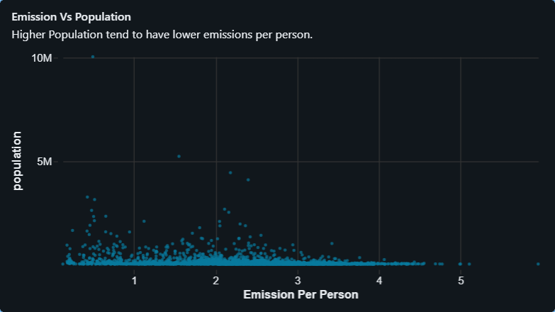
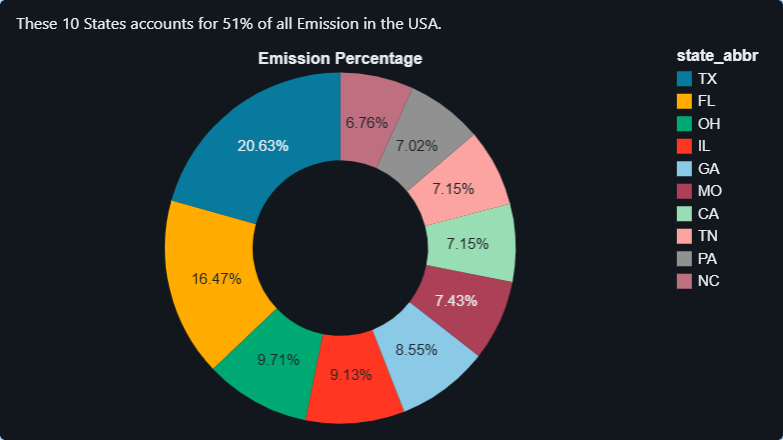
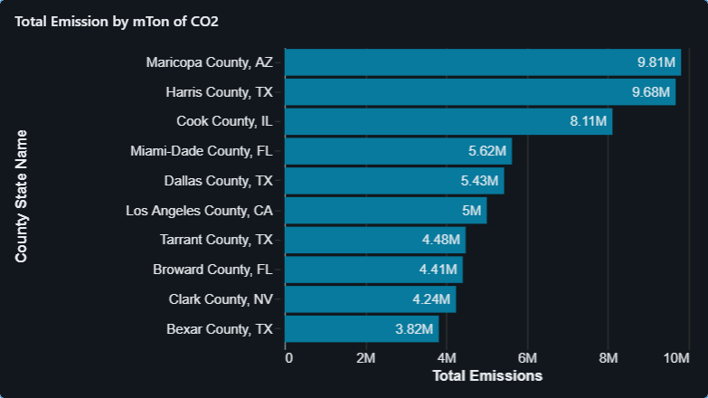

# United States Greenhouse Gas Emissions Analysis (Databricks)


## Project Overview
This project analyzes greenhouse gas emissions across counties in the United States using Databricks Free Edition.
The goal of the project is to explore emission patterns geographically and understand how emissions relate to population at the county and state level.
SQL queries were generated and refined using the Databricks AI Assistant, and the results were visualized through interactive dashboards.

## Tools & Technologies
- **Databricks Free Edition**
- **SQL**
- **Databricks AI Assistant**
- **Databricks Dashboard Visualization**

## Dataset: U.S. County-Level Emissions Data (2023)
The dataset includes environmental and energy-related metrics for 3,000+ counties across the United States, including:
- Population
- Energy consumption
- Vehicle miles traveled
- Fuel consumption
- Greenhouse gas emissions

Key metric used in this analysis:
**GHG emissions (million tons CO₂ equivalent)**

## 🔎 Analysis & Visualizations

1. **Geographic Distribution of Emissions:**
This visualization maps emissions across counties using latitude and longitude coordinates.
     ```sql
     SELECT latitude,
     longitude,
     `GHG emissions mtons CO2e` as Emissions
     FROM emissions.default.emissions_data



**Visualization: Map visualization showing emission intensity across counties**


2. **Emissions Per Person:**
To understand environmental impact relative to population size, emissions were normalized per person.

     ```sql
     SELECT county_state_name,
            population,
            TRY_CAST(REPLACE(`GHG emissions mtons CO2e`, ',', '') AS DOUBLE) / CAST(population AS DOUBLE) AS Emissions_per_person
     FROM emissions_data
     ORDER BY Emissions_per_person DESC



**Visualization: Scatter Plot – Emissions vs Population**


3.  **Total Emissions by State:**
This analysis aggregates emissions by state to identify the largest contributors.
     ```sql
     SELECT state_abbr,
          SUM(TRY_CAST(REPLACE(`GHG emissions mtons CO2e`, ',', '') AS DOUBLE))  AS Total_Emissions
     FROM emissions_data
     GROUP BY state_abbr
     ORDER BY Total_Emissions DESC
     LIMIT 10 



**Visualization: Pie Chart – Top Emitting States**

4. **Top Counties by Emissions:**
Identifies counties with the highest greenhouse gas emissions.
     ```sql
     SELECT county_state_name,
          population,
          TRY_CAST(REPLACE(`GHG emissions mtons CO2e`, ',', '') AS DOUBLE) AS Total_Emission
     FROM emissions_data
     ORDER BY Total_Emission DESC
     LIMIT 10



**Visualization: Bar Chart – Highest Emitting Counties**

## Key Insights
- Greenhouse gas emissions vary significantly across U.S. counties.
- Counties with larger populations often show **lower emissions per person**, suggesting more efficient energy use or shared infrastructure in densely populated areas.
- Some smaller counties display **higher emissions per person**, which may indicate the presence of industrial facilities, energy production sites, or lower population distributing total emissions across fewer residents.
- Emissions are concentrated in certain regions, highlighting geographic differences in energy consumption and economic activity.
- Certain states contribute disproportionately to total U.S. emissions.

## Project Structure

```
databricks-us-emissions-analysis
│
├── Emissions_SQL_Queries
│   ├── county_state_emission.sql
│   ├── emissions_per_person.sql
│   ├── total_emissions_per_state.sql
│   └── location_data.sql
│
├── Dashboard_Visualization
│   ├── Bar_county_wise_emission.png
│   ├── Map_Location_Data.png
│   ├── Pie_Emission_by_state.png
│   └── Scatter_Emission_per_person.png
│
└── README.md
```

## Future Improvements
- Perform deeper analysis on emissions by energy source (electricity, transportation, fuel consumption).
- Create additional visualizations comparing emissions with population and energy consumption.
- Build predictive models to estimate future emission trends.
- Integrate the dataset with BI tools such as Tableau or Power BI for advanced dashboards.
- Expand the analysis to include multiple years of data for time-series insights.

## Author
**Muzna Mokashi**

Aspiring Data Analyst building hands-on projects using SQL, Databricks, and data visualization.


  


